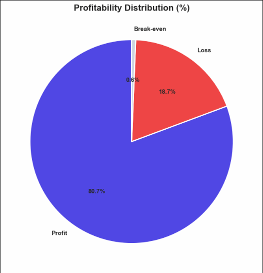
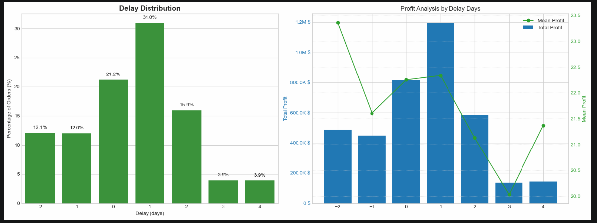
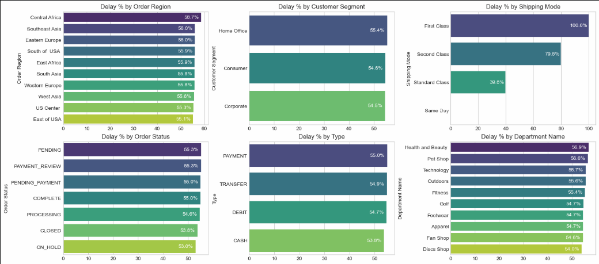
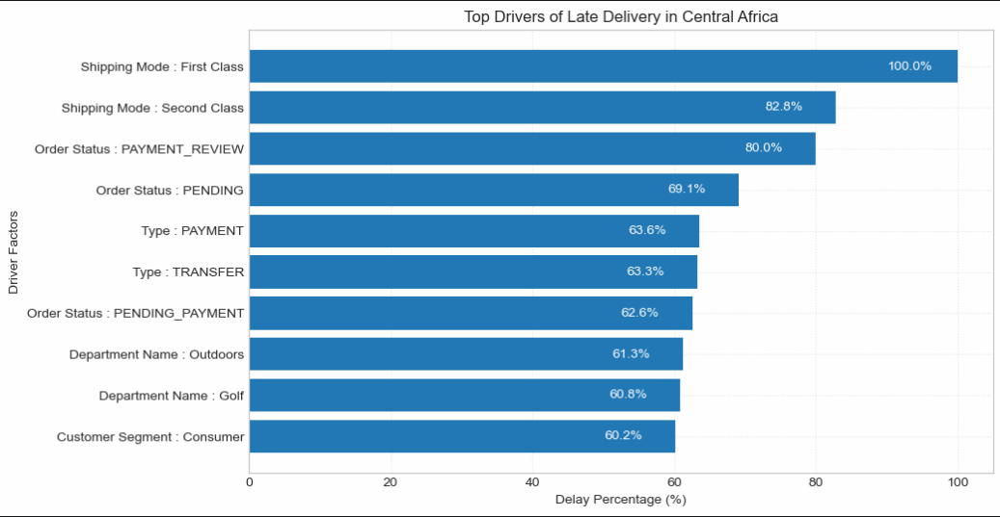
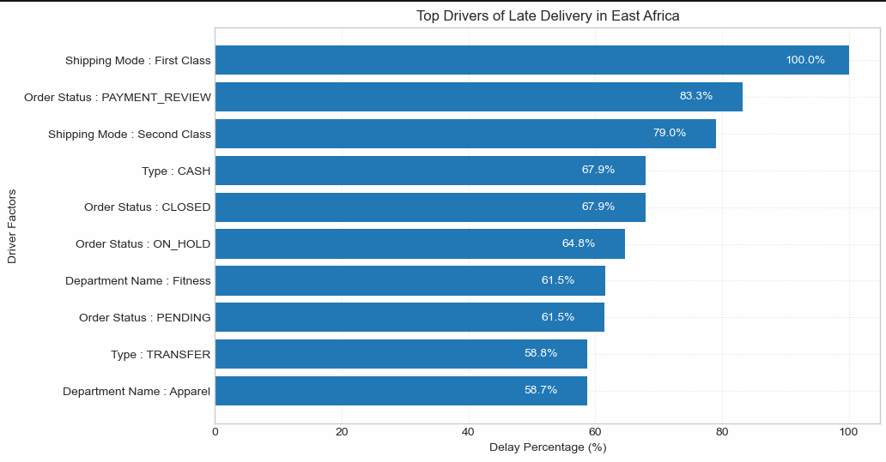
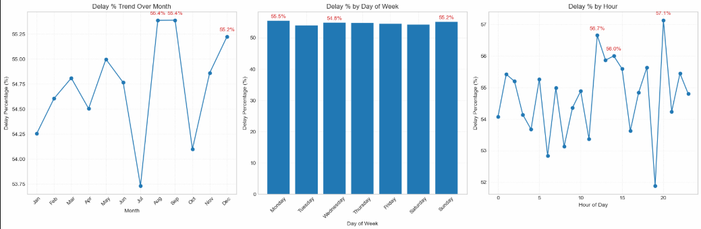
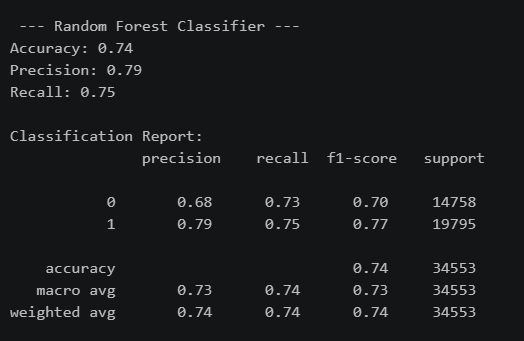

# 🚚 Supply Chain Analysis 

An end-to-end supply chain analytics project focused on delivery performance, operational bottlenecks, profitability risk, and predictive identification of delayed orders.

---

## 📌 Project Overview

This project analyzes an e-commerce supply chain dataset to understand why orders are delayed, where operational bottlenecks occur, and how delivery performance affects profitability.

The analysis follows an end-to-end data analytics workflow:

**Data Cleaning → Feature Engineering → EDA → Profitability Analysis → Bottleneck Detection → Root Cause Analysis → Time-Based Analysis → Machine Learning → Business Recommendations**

The objective is to convert transaction-level supply chain data into actionable insights that can help improve delivery reliability, protect profitability, and support proactive order-risk management.

---

## 🏢 Business Problem

A global e-commerce operation manages end-to-end order fulfillment across multiple regions. Actual shipping times frequently deviate from scheduled timelines, creating:

- 🚚 Late deliveries
- ⚠️ Inconsistent delivery performance
- 💰 Profitability risk
- 🔎 Operational bottlenecks
- 📉 Reduced customer trust

### 🎯 Desired Outcome

Identify the major drivers of delivery delays and build a predictive system that can flag high-risk orders before delivery problems occur.

---

## 📊 Dataset

The project uses the **DataCo Supply Chain** dataset.

### Dataset Profile

| Metric | Value |
|---|---:|
| Initial Records | **180,519** |
| Initial Columns | **53** |
| Duplicate Rows | **0** |
| Records After Cleaning | **172,765** |
| Final Modeling Records | **172,765** |

The cleaning process removes irrelevant, redundant, highly missing, and low-variance fields before analysis.

### Key Data Areas

- 📦 Order and shipping dates
- 🚛 Shipping mode
- ⏱️ Scheduled vs. actual shipping time
- 📋 Delivery status
- 👥 Customer segment
- 🌍 Order region
- 🏢 Department
- 🏷️ Product category
- 📑 Order status
- 💵 Sales and profit
- 💳 Payment/order type

---

## 🧹 Data Cleaning & Feature Engineering

The notebook performs several preprocessing steps:

- Removed irrelevant and redundant columns
- Removed highly missing fields
- Removed cancelled orders from delivery-time analysis
- Converted order and shipping dates to datetime
- Calculated **Order Processing Time**
- Calculated **Delay**
- Created **Is_Delayed**
- Created **Profitability Flag**
- Extracted:
  - 📅 Order month
  - 📆 Order day
  - ⏰ Order hour

### Delay Calculation

The analysis compares actual shipping time against scheduled shipping time to identify early, on-time, and delayed orders.

---

# 📈 Exploratory Data Analysis

## 💰 Profitability Distribution

The cleaned dataset contains:

- 🟢 **80.7% Profit**
- 🔴 **18.7% Loss**
- ⚪ **0.6% Break-even**



---

## 🚚 Delay & Profitability Analysis

The largest single delay group is **1 day**, representing approximately **31.0% of orders**.

| Delay | Order Share |
|---:|---:|
| -2 days | 12.1% |
| -1 day | 12.0% |
| 0 days | 21.2% |
| **1 day** | **31.0%** |
| 2 days | 15.9% |
| 3 days | 3.9% |
| 4 days | 3.9% |

The project also evaluates total and average profit across different delay levels.



---

# 🚨 Business KPIs

| KPI | Result |
|---|---:|
| Total Orders | **172,765** |
| Late Deliveries | **94,523** |
| Late Delivery Rate | **54.71%** |
| On-Time Delivery Rate | **45.29%** |
| 90th Percentile Delay | **3 days** |
| Total Positive Order Profit | **~$7.5M** |
| Delayed-Order Profit Impact / At-Risk Profit | **~$2.1M** |

> **Note:** The `$2.1M` metric is calculated from order profit associated with delayed orders. It is interpreted as delayed-order profit impact / profit at risk rather than a separately audited accounting loss.

---

# 🔎 Bottleneck Detection

Delay rates were compared across major operational dimensions:

- 🌍 Order Region
- 👥 Customer Segment
- 🚛 Shipping Mode
- 📦 Order Status
- 🏷️ Order Type
- 🏢 Department

The analysis shows that **shipping mode is one of the strongest operational drivers**, with First Class showing an extreme delay rate in the analyzed data.



---

# 🧩 Root Cause Analysis

The project drills down into regional patterns to identify specific combinations of factors associated with high delay rates.

## 🌍 Central Africa

The highest-risk factor levels include:

- 🚛 **First Class Shipping — 100.0% delay**
- 🚛 Second Class Shipping — 82.8%
- 💳 PAYMENT_REVIEW — 80.0%
- 📋 PENDING — 69.1%
- 💳 PAYMENT — 63.6%



---

## 🌍 East Africa

The analysis also identifies high-delay factor levels such as:

- 🚛 **First Class Shipping — 100.0% delay**
- 💳 PAYMENT_REVIEW — 83.3%
- 🚛 Second Class Shipping — 79.0%
- 💵 CASH — 67.9%



These results indicate that delivery problems are not explained by a single dimension; shipping mode, order/payment status, order type, department, and region can interact to create operational risk.

---

# 🕒 Time-Based Delay Analysis

The project examines delay rates by:

- 📅 Month
- 📆 Day of week
- ⏰ Hour of day

Monthly delay rates remain relatively close to the overall level, while hourly analysis shows more noticeable variation.

The highest observed hourly delay rate in the notebook is approximately **57.1% at hour 20**.



---

# 🤖 Machine Learning

## 🎯 Objective

Predict whether an order is at risk of late delivery using order-level operational features.

### Features Used

- Type
- Days for shipment (scheduled)
- Category Name
- Customer Segment
- Department Name
- Order Region
- Shipping Mode
- Order month
- Order hour

Categorical variables are transformed using frequency and target-based encoding before modeling.

---

## ⚖️ Class Balancing

SMOTE is applied to the training data.

| Training Set | Class 0 | Class 1 |
|---|---:|---:|
| Before SMOTE | 59,030 | 79,182 |
| After SMOTE | 79,182 | 79,182 |

---

# 🌲 Random Forest Results

The project uses a **Random Forest Classifier**.

| Metric | Score |
|---|---:|
| Accuracy | **74%** |
| Precision | **79%** |
| Recall | **75%** |
| F1-score — Class 1 | **77%** |

### 📊 Random Forest Results



The model provides a practical baseline for identifying orders with elevated late-delivery risk.

---

# 💡 Key Insights

1. 🚨 More than half of analyzed orders are classified as delayed.
2. 🚛 Shipping mode is a major operational driver of delivery risk.
3. ⚠️ First Class shows particularly severe delay performance in the regional root-cause analysis.
4. 💳 Payment/order-status categories such as `PAYMENT_REVIEW` and `PENDING` appear among several high-delay factor levels.
5. 📅 Delay rates vary by month, day, and hour, although monthly variation is relatively narrow.
6. 💰 Delivery delays are associated with a substantial profitability impact.
7. 🤖 The Random Forest model provides a baseline predictive capability with **74% accuracy and 75% recall**.

---

# 🎯 Business Recommendations

### 1. 🚛 Review Shipping Mode Configuration

Investigate First Class and Second Class routing, service-level configuration, carrier assignment, and promised delivery windows.

### 2. 🔔 Deploy Predictive Risk Scoring

Use the Random Forest model as a baseline risk-scoring layer to identify potentially delayed orders before fulfillment.

### 3. 💳 Investigate Payment Processing Bottlenecks

Prioritize order statuses such as `PAYMENT_REVIEW` and `PENDING` where high delay rates are observed.

### 4. 📅 Improve Operational Planning

Use time-based delay patterns to strengthen staffing, fulfillment capacity, and shipping planning during higher-risk periods.

### 5. 🌍 Prioritize High-Risk Regions

Use regional root-cause analysis to focus operational investigations where specific shipping modes or order states exhibit unusually high delay rates.

### 6. 📊 Establish Continuous KPI Monitoring

Track:

- Late delivery rate
- On-time delivery rate
- Delay distribution
- Profit at risk
- Shipping-mode performance
- Predictive model precision and recall

---

# 🗂️ Project Structure

```text
## 🗂️ Project Structure

```text
Supply-Chain-Analysis/
│
├── 📓 supply_chain_analysis.ipynb
├── 📄 README.md
├── ⚙️ requirements.txt
│
├── 📂 data/
│   ├── 📄 README.md
│  
└── 🖼️ images/
    ├── 📊 profitability_distribution.png
    ├── 📈 delay_and_profit_analysis.png
    ├── 🚨 bottleneck_detection.png
    ├── 🌍 root_cause_central_africa.png
    ├── 🌍 root_cause_east_africa.png
    ├── 🕒 time_based_delay_analysis.png
    └── 🤖 random_forest_results.png


